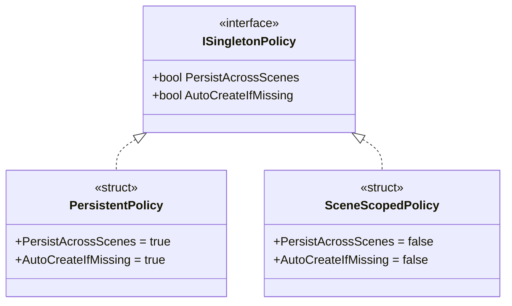

# ポリシー駆動型Unityシングルトン（v1.0.1）

[English README](./README.md)

MonoBehaviour 向けの **ポリシー駆動型シングルトン基底クラス**です。

## 目次

- [動作環境](#requirements--動作環境)
- [パフォーマンス考慮事項](#performance-considerations--パフォーマンス考慮事項)
- [概要](#overview--概要)
  - [提供クラス](#提供クラス)
  - [主な特長](#主な特長)
- [アーキテクチャ](#architecture--アーキテクチャ)
  - [コンポーネント概要](#コンポーネント概要)
  - [ポリシー比較](#ポリシー比較)
  - [Domain Reload 無効時: Play セッション境界](#domain-reload-無効時-play-セッション境界)
- [ディレクトリ構成](#directory-structure--ディレクトリ構成)
- [前提としている Unity API の挙動](#dependencies--前提としている-unity-api-の挙動)
- [インストール](#installation--インストール)
- [使い方](#usage--使い方)
  - [GlobalSingleton](#1-globalsingleton)
  - [SceneSingleton](#2-scenesingleton)
  - [Instance と TryGetInstance の使い分け](#3-instance-と-trygetinstance-の使い分け典型例)
  - [キャッシュの推奨](#4-キャッシュの推奨重要)
- [Public API Details](#public-api-details)
- [設計意図（補足）](#design-intent--設計意図補足)
- [制約と推奨事項](#constraints--best-practices--制約と推奨事項)
- [Advanced Topics](#advanced-topics)
- [Edit Mode の挙動](#edit-mode-の挙動詳細)
- [IDE Configuration](#ide-configurationrider--resharper)
- [テスト](#testing--テスト)
- [既知の制限事項](#known-limitations--既知の制限事項)
- [トラブルシューティング](#troubleshooting--トラブルシューティング)
- [References](#references)
- [License](#license)

## Requirements / 動作環境

* **Unity 2022.3** 以降（Unity 6.3でテスト済み）
* **Enter Play Mode Options** の **Reload Domain** 有効/無効の両方に対応
* 外部依存なし

## Performance Considerations / パフォーマンス考慮事項

* **ポリシー解決**: ゼロアロケーション（readonly struct）
* **インスタンスアクセス**: 自動生成時のみ最小限のアロケーション
* **検索操作**: Unity の最適化された `FindAnyObjectByType` を使用
* **キャッシュ**: 頻繁なアクセスがある場合は参照のキャッシュを推奨

## Overview / 概要

本ライブラリは、用途別に 2 種類のシングルトン基底クラスを提供します。

共通のコアロジックを持ちながら、**ポリシー**によってライフサイクル（永続化や自動生成の有無）を制御します。

### 提供クラス

| クラス | シーン間永続 | 自動生成 | 用途 |
| --- | --- | --- | --- |
| **`GlobalSingleton<T>`** | ✅ する | ✅ する | ゲーム全体で常に存在するマネージャ（GameManager など） |
| **`SceneSingleton<T>`** | ❌ しない | ❌ しない | 特定のシーン内でのみ動作するコントローラ（LevelController など） |

### 主な特長

* **ポリシー駆動**: 永続化（`DontDestroyOnLoad`）や自動生成の挙動をポリシーで分離します。
* **Domain Reload 無効化対応**: static フィールドが残留する環境でも、Play セッション ID を用いて確実にキャッシュをリセットします。
* **安全なライフサイクル**:
  * **終了処理**: `Application.quitting` を考慮し、終了中の生成やアクセスを抑制します。
  * **Edit Mode**: エディタ実行中は「検索のみ」を行い、生成や static キャッシュ更新といった副作用を起こしません。
  * **再初期化 (Soft Reset)**: 状態リセットは **Play セッション境界**で行い、Play ごとに再初期化を実行します（方針は `PlaySessionId` に寄せています）。
* **厳密な型チェック**: ジェネリック型 `T` と実体型が一致しない参照は拒否し、誤用を防ぎます。
* **開発時の安全性 (DEV/EDITOR/ASSERTIONS)**:
  * **fail-fast の範囲**: fail-fast ガードは Editor / Development Build で動作し、Player ビルドでもアサーション有効時（例: `BuildOptions.ForceEnableAssertions` / `UNITY_ASSERTIONS`）は一部が有効になり得ます。
* **Player ビルド最適化**:
  * ログや多くの検証呼び出しは `[Conditional]` によりストリップされます。
  * アサーション有効の Player ビルドでは、一部の開発用ガードが残る可能性があります。
  * 検証がストリップされる構成では、API は fail-soft として `null` / `false` を返します（利用側でハンドリングしてください）。

終了処理に関する注記（重要）:
- Unity の終了処理（`Application.quitting`）や Editor の Play Mode 終了通知は、Unity バージョンや実行環境（Editor / Player）によって発火順やタイミングが揺れることがあります。
- 本ライブラリは終了シーケンスを完全に制御することは目指さず、`IsQuitting` を **ベストエフォートのガード**として扱い、終了中のアクセス抑制と「終了中の復活（resurrection）」の回避を行います。

  * `FindAnyObjectByType(...Exclude)` は **非アクティブを見ない**ため、非アクティブなシングルトンが存在すると「見つからない扱い → 自動生成 → 隠れ重複」になり得ます。これを避けるため、DEV/EDITOR/ASSERTIONS では非アクティブ検出時に **fail-fast（例外）** にします。
  * SceneSingleton をシーンに置き忘れた状態でアクセスした場合も、DEV/EDITOR/ASSERTIONS では **fail-fast（例外）** にします。

## Architecture / アーキテクチャ

### コンポーネント概要

```text
┌─────────────────────────────────────────────────────────────────────┐
│                           Public API                                │
│  ┌───────────────────────────┐    ┌───────────────────────────────┐ │
│  │    GlobalSingleton<T>     │    │      SceneSingleton<T>        │ │
│  │    (PersistentPolicy)     │    │     (SceneScopedPolicy)       │ │
│  │  • DontDestroyOnLoad      │    │  • Scene lifecycle bound      │ │
│  │  • Auto-create if missing │    │  • No auto-create             │ │
│  └─────────────┬─────────────┘    └───────────────┬───────────────┘ │
└────────────────┼──────────────────────────────────┼─────────────────┘
                 │                                  │
                 └──────────────┬───────────────────┘
                                │ 継承
                                ▼
┌─────────────────────────────────────────────────────────────────────┐
│                 SingletonBehaviour<T, TPolicy>                      │
│  ┌─────────────────┐ ┌─────────────────┐ ┌────────────────────────┐ │
│  │    Instance     │ │  TryGetInstance │ │   Lifecycle Hooks      │ │
│  │  (auto-create)  │ │  (safe access)  │ │  OnPlaySessionStart()  │ │
│  └─────────────────┘ └─────────────────┘ └────────────────────────┘ │
└─────────────────────────────┬───────────────────────────────────────┘
                              │ 使用
          ┌───────────────────┼───────────────────┐
          ▼                   ▼                   ▼
┌─────────────────┐  ┌─────────────────┐  ┌─────────────────────────┐
│ SingletonRuntime│  │ ISingletonPolicy│  │    SingletonLogger      │
│ • PlaySessionId │  │ • PersistAcross │  │ • Log/Warn/Error        │
│ • IsQuitting    │  │   Scenes        │  │ • Conditional compile   │
│ • Thread check  │  │ • AutoCreateIf  │  │ • Stripped in Player    │
│                 │  │   Missing       │  │   builds (by design)    │
└────────┬────────┘  └─────────────────┘  └─────────────────────────┘
         │ Editorフック
         ▼
┌─────────────────────┐
│SingletonEditorHooks │
│ (Play Mode events)  │
└─────────────────────┘
````

補足:

* **エディターフックの向き**: `SingletonEditorHooks`（Editor のみ）が `SingletonRuntime.NotifyQuitting()` を呼びます（Runtime 側が Editor Hooks に依存するわけではありません）。
* **名前空間/ビルド対象**: `SingletonEditorHooks` は `TomoLudens.PolicySingleton.Editor` 配下で、Editor ビルド時のみコンパイルされます。

### ポリシー比較



補足:

* ポリシー実装は `readonly struct` で、プロパティは常に一定値を返す設計です（`default(TPolicy)` でゼロアロケーション）。

### Domain Reload 無効時: Play セッション境界

```text
 Play Session 1                          Play Session 2
───────────────────────────────────────────────────────────────────────────────▶
                                                                          time
    ┌─────────────────────┐              ┌─────────────────────┐
    │  PlaySessionId: 1   │              │  PlaySessionId: 2   │
    └─────────────────────┘              └─────────────────────┘
              │                                      │
    ┌──────────▼────────┐                ┌───────────▼─────────┐
    │  Static cache OK  │                │   Static cache OK   │
    │  Instance: 0xABC  │   ─────────▶   │   Instance: 0xABC   │ (same object)
    └───────────────────┘   Invalidate   └─────────────────────┘
                            & Refresh
                                 │
                    ┌────────────▼────────────┐
                    │ OnPlaySessionStart()    │
                    │ called again            │
                    │ (per-session reinit)    │
                    └─────────────────────────┘
```

補足:

* `PlaySessionId` が変化すると static キャッシュ（`_instance`）は無効化されます。シーン上のオブジェクトが残っている場合は、再探索で同一インスタンスを掴み直します。

## Directory Structure / ディレクトリ構成

```text
PolicySingleton/
├── Core/
│   ├── AssemblyInfo.cs                                     # InternalsVisibleTo（テスト用）
│   ├── SingletonBehaviour.cs                               # コア実装
│   ├── SingletonLogger.cs                                  # 条件付きロガー（Playerビルドで除去）
│   └── SingletonRuntime.cs                                 # 内部ランタイム（Domain Reload対策）
├── Editor/
│   ├── SingletonEditorHooks.cs                             # Editorイベントフック（Play Mode状態）
│   └── TomoLudens.PolicySingleton.Editor.asmdef            # Editor用アセンブリ定義
├── Policy/
│   ├── ISingletonPolicy.cs                                 # ポリシーインターフェース
│   ├── PersistentPolicy.cs                                 # 永続ポリシーの実装
│   └── SceneScopedPolicy.cs                                # シーンスコープポリシーの実装
├── Tests/                                                  # PlayMode & EditMode テスト
│   ├── Editor/
│   │   ├── PolicySingletonEditorTests.cs                   # EditModeテスト
│   │   └── TomoLudens.PolicySingleton.Editor.Tests.asmdef  # Editorテスト用アセンブリ定義
│   ├── Runtime/
│   │   ├── PolicySingletonRuntimeTests.cs                  # PlayModeテスト
│   │   └── TomoLudens.PolicySingleton.Tests.asmdef         # Runtimeテスト用アセンブリ定義
│   └── TestExtensions.cs                                   # テスト用拡張メソッド
├── GlobalSingleton.cs                                      # Public API（永続・自動生成あり）
├── SceneSingleton.cs                                       # Public API（シーン限定・自動生成なし）
└── TomoLudens.PolicySingleton.asmdef                       # Assembly Definition
```

## Dependencies / 前提としている Unity API の挙動

本実装は、次の Unity API 仕様を前提に設計しています（Unity 側の挙動が変わると設計の前提も変わります）。

| API / 機能 | 前提としている挙動 |
| --- | --- |
| Domain Reload 無効 | **static 変数**と **static event の購読**が Play 間で残ります。これを前提に `PlaySessionId` でキャッシュを無効化します。 |
| Scene Reload 無効 | Scene Reload を無効にすると、シーンは再読み込みされません。**通常起動時と同じコールバック順（新規ロード前提）を期待しません**。状態リセットは Play セッション境界（`PlaySessionId`）に寄せます。 |
| `Object.FindAnyObjectByType<T>(FindObjectsInactive.Exclude)` | 既定では **非アクティブは対象外**です。そのため非アクティブなシングルトンは「存在しても見つからない」扱いになり得ます（→ DEV/EDITOR/ASSERTIONS の fail-fast 方針）。また、返るオブジェクトは呼び出しごとに同一である保証がありません。 |
| `Object.DontDestroyOnLoad` | **ルート GameObject**に対して適用する必要があります（そのため Persistent は必要に応じてルートへ移動します）。 |
| `Object.Destroy` | 実際の破棄は遅延され、現在の Update ループの後（ただし描画前）などに行われます。これにより同フレーム内で「検索に再ヒット」し得るため、必要に応じて同フレーム再検出を避ける工夫が必要です。 |

## Installation / インストール

1. プロジェクトの任意の場所（例: `Assets/Plugins/PolicySingleton/`）に `PolicySingleton` フォルダを配置してください。
2. 必要に応じて名前空間やアセンブリ定義（Assembly Definition）を調整してください。

## Usage / 使い方

### 1. GlobalSingleton

シーンを跨いで生存し、アクセス時に見つからなければ自動生成します。

```csharp
using TomoLudens.PolicySingleton;

// 継承禁止 (sealed) を推奨します
public sealed class GameManager : GlobalSingleton<GameManager>
{
    public int Score { get; private set; }
    public int CurrentLevel { get; private set; }

    protected override void Awake()
    {
        base.Awake(); // 必須 - シングルトンを初期化します
        Score = 0;
        CurrentLevel = 1;
    }

    // Playセッションごとの再初期化（Domain Reload無効時など）
    protected override void OnPlaySessionStart()
    {
        // Playセッション開始時（Play Mode開始時やDomain Reload無効での再開時）に呼ばれる
        // Awakeは初回のみだが、OnPlaySessionStartはPlayセッションごとに呼ばれる
        Debug.Log($"New play session started. Current level: {CurrentLevel}");

        // セッションごとの状態をリセット
        // 例: 一時的なデータ、イベント購読、キャッシュなど
        ResetTemporaryData();
        RebindEvents();
    }

    private void ResetTemporaryData()
    {
        // Playセッション間で保持したくない一時データをクリア
        // 例: UI状態、未保存の作業中データなど
    }

    private void RebindEvents()
    {
        // イベントの再購読（Domain Reload無効時などに購読が残っている/失われる場合への対策）
        // 例: GameManager.OnGameStateChanged -= HandleGameStateChanged;
        //     GameManager.OnGameStateChanged += HandleGameStateChanged;
    }

    public void AddScore(int value) => Score += value;
    public void NextLevel() => CurrentLevel++;
}

// 利用例:
// GameManager.Instance.AddScore(10);
// GameManager.Instance.NextLevel();
```

#### OnPlaySessionStart の重要性

`OnPlaySessionStart` は特に **Domain Reload を無効にしている場合** に重要です：

| メソッド | 呼ばれるタイミング | 用途 |
| --- | --- | --- |
| `Awake()` | 初回のPlay Mode開始時のみ | 永続的な初期化（リソース読み込み、静的設定） |
| `OnPlaySessionStart()` | **Playセッションごと** | セッション固有の初期化（一時データ、イベント購読） |

**なぜ必要か？**

* Domain Reload 無効時、static フィールドが Play セッション間で保持される
* イベント購読や一時データが前回のセッションから残っている可能性がある
* `OnPlaySessionStart` でセッション境界の再初期化を徹底できる

### 2. SceneSingleton（Sceneスコープのシングルトン）

Scene 上に配置して使用します。自動生成は行わず、Scene アンロードと共に破棄されます。

```csharp
using TomoLudens.PolicySingleton;

public sealed class LevelController : SceneSingleton<LevelController>
{
    protected override void Awake()
    {
        base.Awake(); // 必須 - シングルトンを初期化します
        // Sceneごとの初期化
    }
}

// ⚠️ Sceneに配置必須
// 置き忘れた場合、DEV/EDITOR/ASSERTIONS では例外、それ以外の Player ビルドでは null / false になります
// LevelController.Instance.DoSomething();
```

### 3. `Instance` と `TryGetInstance` の使い分け（典型例）

Player ビルドでは、多くの DEV/EDITOR 検証が `[Conditional]` によりストリップされます。アサーションが有効な構成では、一部の fail-fast ガードが残る可能性があります。

| 使い分け | 原則 | 代表例 |
| --- | --- | --- |
| **`Instance`** | その機能が **必須** で、存在しない状態を許容しません。 | ゲーム進行に必須の Manager（`GameManager`, `AudioManager` など）の **起動時/初期化時** |
| **`TryGetInstance`** | 「あるなら使う」「ないなら何もしない」を徹底します。<br>勝手な生成・復活・順序依存を避けます。 | **後片付け・解除・一時停止/復帰**（`OnDisable` / `OnDestroy` / `OnApplicationPause` など） |

#### 典型例: 解除系は TryGetInstance を原則にします

```csharp
private void OnDisable()
{
    if (AudioManager.TryGetInstance(out var am))
    {
        am.Unregister(this);
    }
}

private void OnDestroy()
{
    if (GameManager.TryGetInstance(out var gm))
    {
        gm.Unregister(this);
    }
}

private void OnApplicationPause(bool paused)
{
    if (paused && Telemetry.TryGetInstance(out var t))
    {
        t.Flush();
    }
}
```

#### 典型例: 起動時に必要なものは Instance で確実に確立します（キャッシュ前提）

```csharp
private GameManager _gm;

private void Awake()
{
    _gm = GameManager.Instance; // 必須なので Instance
}

private void Update()
{
    if (_gm == null) return; // Player ビルドでは null になり得るため保険
    // ...
}
```

### 4. キャッシュの推奨（重要）

`Instance` は内部で検索や検証を行うため、**`Update` 等で毎フレーム呼び出す運用は避けてください**。`Start` / `Awake` で取得してキャッシュし、その参照を使ってください。

```csharp
public class Player : MonoBehaviour
{
    private GameManager _gameManager;

    private void Start()
    {
        _gameManager = GameManager.Instance; // ここでキャッシュ
    }

    private void Update()
    {
        if (_gameManager == null) return;
        // _gameManager.DoSomething();
    }
}
```

## Public API Details

### `static T Instance { get; }`

| 状態 | 挙動 |
| --- | --- |
| **Play 中 (正常)** | 確立済みならキャッシュを返します。未確立なら検索し、Persistent は必要なら生成します。 |
| **終了処理中** | 常に `null` を返します。 |
| **Edit Mode** | 検索のみ行います（生成せず、static キャッシュも更新しません）。 |
| **非アクティブを検出** | DEV/EDITOR/ASSERTIONS では例外、それ以外の Player ビルドでは `null` です。 |
| **型不一致** | 派生型など、実体型が `T` と完全一致しない参照は拒否します。Play 中は、同フレームの再検出（`Destroy` の遅延破棄 + Find の非決定性）を避けるために、必要に応じて破棄前に `GameObject` を非アクティブ化してから破棄する場合があります。 |
| **Scene に置き忘れ** | SceneSingleton が見つからない場合、DEV/EDITOR/ASSERTIONS では例外、それ以外の Player ビルドでは `null` です。 |

### `static bool TryGetInstance(out T instance)`

インスタンスが存在すれば取得します。**未生成時の自動生成は行いません**。

| 状態              | 挙動 |
| ----------------- | --- |
| **存在すれば**     | `true` と参照を返します。 |
| **存在しなければ** | `false` と `null` を返します。 |
| **終了処理中**     | 常に `false` です。 |
| **Edit Mode**     | 検索のみ行います（キャッシュしません）。 |

## Design Intent / 設計意図（補足）

### なぜポリシーで挙動を分けるのですか？

永続化・自動生成などの「挙動」をポリシー（`ISingletonPolicy`）で分離し、コアロジックを共有するためです。

### なぜ `SingletonRuntime` が必要なのですか？

Domain Reload を無効化すると、static フィールドや static イベント購読が Play 間で残る前提になります。そのため、Play 開始ごとに **型ごとの static キャッシュを無効化する仕組み** が必要です。

1. Play 開始時に確実に呼ばれる場所（`SubsystemRegistration`）で `PlaySessionId` を更新します。
2. シングルトン側は `PlaySessionId` を参照して、古いセッションのキャッシュを破棄・再検索します。

### なぜ `SingletonRuntime` に初期化を集約するのですか？

Domain Reload を無効化すると、Play のたびに「static が初期状態に戻る」保証がありません。Unity 公式ドキュメントでも、Domain Reload 無効時は static 変数と static event の購読が保持されることが明記されています。

そのため本実装では、Play の開始ごとに `PlaySessionId` を更新し、`SingletonBehaviour` 側で「古いセッションの static キャッシュ」を確実に無効化します。

また、Unity では **ジェネリック型に付けた `RuntimeInitializeOnLoadMethod` が期待どおり呼ばれない**問題が報告されています（Issue Tracker）。そのため、初期化は非ジェネリック側（`SingletonRuntime`）へ集約します。

## Constraints & Best Practices / 制約と推奨事項

### 0. 意図的な制約（設計上の契約）

本ライブラリは、Unity で起きやすい「隠れ重複」「終了中の復活」「初期化順の密結合」といったデバッグ困難な問題を減らすため、意図的に制約を設けています。DEV/EDITOR ビルドでは、誤用を早期発見するために一部が fail-fast（例外）になります。

* **メインスレッド限定（Play 中）**: `Instance` / `TryGetInstance` は Play 中はメインスレッドから呼び出す前提です。
* **厳密な型一致**: 実体型が `T` と完全一致しない参照は拒否します（派生型などは受け付けません）。
* **非アクティブ/Disabled を避ける**: Unity の検索 API 仕様上、非アクティブ/Disabled は「見つからない扱い」になり得るため、DEV/EDITOR/ASSERTIONS では隠れ重複防止のため fail-fast にします。
* **SceneSingleton はシーン配置必須**: Scene スコープは自動生成しません。置き忘れは DEV/EDITOR/ASSERTIONS で例外、それ以外の Player ビルドでは `null` / `false` です。
* **終了処理中**: 終了中は `null` / `false` を返し、復活防止のためアクセスを抑制します（ベストエフォート）。
* **Player ビルドでは `null` / `false` になり得る（アサーション有効時は例外が残る可能性もある）**: 検証・ログはストリップされる前提のため、利用側でハンドリングしてください。

### 1. 具象クラスは `sealed` を推奨します

具象シングルトン（例：`GameManager`）をさらに継承することは推奨しません。
`class Derived : GameManager` のような継承は型チェック機構により実行時に拒否されます。

### 2. Unity メッセージのオーバーライド時は `base` 呼び出しが必須です

`Awake`, `OnEnable`, `OnDestroy` をオーバーライドする場合、**必ず基底クラス（base）のメソッドを呼んでください**。

補足（検出できる/できない範囲）:

* `base.Awake()` の呼び忘れは、基底 `OnEnable()` の経路で検出・ログ出力されます（その経路が実行される場合）。
* `base.OnEnable()` / `base.OnDestroy()` の呼び忘れは確実には検出できませんが、初期化/クリーンアップの挙動が壊れ得ます。

```csharp
protected override void Awake()
{
    base.Awake(); // 必須です
    // 追加の初期化
}
```

呼ばない場合でも、最初のアクセス時に初期化が走る「保険」はありますが、初期化順が見えにくくなるため非推奨です。必ず `Awake()` メソッドの最初で `base.Awake()` を呼び出してください。

### 3. 配置上の注意

* **多重配置しないでください**: 同一シングルトンを複数シーンに置かないでください（初期化順により、後から読み込まれた方が破棄されます）。
* **Persistent はルート配置が前提です**: 子オブジェクトに付いていた場合でも自動でルートへ移動して永続化しますが、DEV/EDITOR では警告ログが出ます。
* **無効のまま運用しないでください**: シングルトンコンポーネントを Disabled のまま置く運用は避けてください（見つからない扱いになり、隠れ重複の原因になります）。
* **専用の GameObject を推奨**: 重複/型不一致検出時に GameObject 単位で破棄する場合があります。無関係なコンポーネントを同居させないでください。

## Advanced Topics

### Soft Reset（Play ごとの再初期化）

Domain Reload 無効環境では static 状態が残ります。本実装は Play セッション境界（`PlaySessionId`）でキャッシュを無効化し、Play ごとに再初期化を実行します。

Unity の `Awake()` は GameObject の生存期間中に 1 回しか呼ばれないため、**Play ごとの再初期化**は `OnPlaySessionStart()`（シングルトンが当該 Play セッションで確立された直後に、Play セッションごとに 1 回呼ばれる）をオーバーライドして行ってください。

`OnPlaySessionStart()` の初期化は **再実行に耐える（冪等）** 書き方にしてください（例：イベント購読は「解除 → 登録」で行います）。

### Threading / Main Thread

`Instance` / `TryGetInstance` は UnityEngine API（Find / GameObject 生成など）を呼ぶため、Play 中は **メインスレッドからの呼び出し** が必須です。

### Initialization Order

初期化順序を厳密に制御したい場合は、`DefaultExecutionOrder` を設定した Bootstrap クラス等で順序を固定してください。

```csharp
[DefaultExecutionOrder(-10000)]
public class Bootstrap : MonoBehaviour
{
    void Awake()
    {
        _ = GameManager.Instance;
        _ = AudioManager.Instance;
        _ = InputManager.Instance;
    }
}
```

## Edit Mode の挙動（詳細）

Edit Mode（`Application.isPlaying == false`）では、次の挙動に固定しています。

* `Instance` / `TryGetInstance` は **検索のみ**行います（自動生成しません）。
* **static キャッシュは更新しません**（副作用を発生させません）。
* そのため、カスタムインスペクタやエディタ拡張から参照しても、Play モードの状態に影響しません。

> 補足: 本実装が使用する `FindAnyObjectByType<T>(FindObjectsInactive.Exclude)` は、既定では **非アクティブを対象外**にします。非アクティブなシングルトンが紛れていると「見つからない扱い」になり得るため、DEV/EDITOR/ASSERTIONS では fail-fast を選びます。

## IDE Configuration（Rider / ReSharper）

### `StaticMemberInGenericType` 警告について

`SingletonBehaviour<T, TPolicy>` の `static` フィールド（`_instance` など）は、ジェネリック型のインスタンス化ごとに分離されます。

シングルトンの用途では **意図どおりの挙動**なので、チーム方針に合わせて次のどちらかに統一してください。

* コード上の抑制コメントで運用
* `.DotSettings` 等で Severity を調整

## Testing / テスト

### 同梱テスト

本パッケージには包括的な PlayMode および EditMode テストが含まれ、**74個の総テスト**（PlayMode 53個 + EditMode 21個）すべて成功しています。

#### PlayMode テスト（53個）

| カテゴリ               | テスト数 | カバレッジ |
| ---------------------- | ---- | --- |
| GlobalSingleton        | 7    | 自動生成、キャッシュ、重複検出 |
| SceneSingleton         | 5    | 配置、自動生成なし、重複検出 |
| InactiveInstance       | 3    | 非アクティブGameObject検出、無効コンポーネント |
| TypeMismatch           | 2    | 派生クラス拒否 |
| ThreadSafety           | 7    | バックグラウンドスレッド保護、メインスレッド検証 |
| Lifecycle              | 2    | 破棄、再生成 |
| SoftReset              | 1    | PlaySessionId 境界での Playごとの再初期化 |
| SceneSingletonEdgeCase | 2    | 未配置、自動生成なし |
| PracticalUsage         | 6    | GameManager、LevelController、状態管理 |
| PolicyBehavior         | 3    | ポリシー駆動挙動検証 |
| ResourceManagement     | 3    | インスタンスライフサイクルとクリーンアップ |
| DomainReload           | 6    | PlaySessionId境界、キャッシュ無効化、終了状態 |
| ParentHierarchy        | 2    | DontDestroyOnLoad用のルート再配置 |
| BaseAwakeEnforcement   | 1    | base.Awake() 呼び出し検出 |
| EdgeCase               | 3    | 破棄インスタンスクリーンアップ、高速アクセス、配置タイミング |

#### EditMode テスト（21個）

| カテゴリ                      | テスト数 | カバレッジ |
| ----------------------------- | ---- | --- |
| SingletonRuntimeEditMode      | 2    | PlaySessionId、IsQuitting 検証 |
| Policy                        | 5    | Policy struct 検証、不変性、インターフェース準拠 |
| SingletonBehaviourEditMode    | 5    | EditMode 挙動、キャッシュ分離 |
| SingletonLifecycleEditMode    | 3    | 親階層、生成、Edit Modeでの共存 |
| SingletonRuntimeStateEditMode | 2    | NotifyQuitting、PlaySessionId一貫性 |
| SingletonLoggerEditMode       | 4    | Log、LogWarning、LogError、ThrowInvalidOperation API |

### テストの実行

1. **Window → General → Test Runner** を開く
2. **PlayMode** または **EditMode** タブを選択
3. **Run All** をクリック

### 独自テストの作成

テスト専用APIは `TestExtensions` 経由で利用可能です：

```csharp
// staticインスタンスキャッシュをリセット（リフレクション使用）
default(MyManager).ResetStaticCacheForTesting();
```

**テスト例:**

```csharp
[UnityTest]
public IEnumerator MyManager_AutoCreates()
{
    var instance = MyManager.Instance;
    yield return null;

    Assert.IsNotNull(instance);
}

[TearDown]
public void TearDown()
{
    if (MyManager.TryGetInstance(out var instance))
    {
        Object.DestroyImmediate(instance.gameObject);
    }
    default(MyManager).ResetStaticCacheForTesting();
}
```

### PlayMode テストの注意点

* `RuntimeInitializeOnLoadMethod` は PlayMode テストでも実行されます。
* `PlaySessionId` がテスト間で進むため、static キャッシュの分離が保証されます。
* テスト汚染を避けるため、`TearDown` で必ずクリーンアップしてください。

## Known Limitations / 既知の制限事項

### 静的コンストラクタのタイミング

シングルトンクラスに静的コンストラクタがある場合、`PlaySessionId` が初期化される前に実行される可能性があります。これにより、まれに予期しない動作を引き起こすことがあります。

### スレッドセーフティ

すべてのシングルトン操作はメインスレッドから呼び出す必要があります。バックグラウンドスレッドからのアクセスは例外をスローせず、`null` / `false` を返します。これにより、Unity バージョン間で安定した動作を保証します。

### シーン読み込み順序

複数のシーンに同じシングルトンタイプが含まれる場合、破棄順序は Unity のシーン読み込みシーケンスに依存します。

### メモリリーク

`OnDestroy` で静的イベント購読が適切にクリーンアップされない場合、Domain Reload 無効時にメモリリークが発生する可能性があります。

## Troubleshooting / トラブルシューティング

### FAQ

**Q. Play Modeでシングルトンがnullを返す**
コンポーネントがアクティブで有効か、メインスレッドから呼び出しているかを確認してください。Awake をオーバーライドしている場合は `base.Awake()` の呼び出しも確認してください。

**Q. 重複シングルトンの警告が出る**
同一シングルトンが複数シーンに配置されている可能性があります。シーンおよびプレハブを確認し、重複インスタンスを削除してください。

**Q. 例外が発生する環境と発生しない環境がある**
DEV/EDITOR/ASSERTIONS の fail-fast 動作によるものです。SceneSingleton がシーンに配置されているか確認してください。解除/後片付け等の経路は `TryGetInstance()` を使用してください。
また、Player ビルドでもアサーションが有効な場合（例: `BuildOptions.ForceEnableAssertions` / `UNITY_ASSERTIONS`）、一部の fail-fast ガードが残る場合があります。

**Q. `Instance`を毎フレーム呼んでも動きますか？**
動作しますが推奨しません。`Start` / `Awake` で取得してキャッシュしてください。

**Q. `Awake`で`base.Awake()`を呼び忘れたらどうなりますか？**
初期化が遅延し、最初の `Instance` / `TryGetInstance` アクセス時に実行されます。動作はしますが、タイミングが予期せず遅れるため `base` 呼び出しを徹底してください。

**Q. SceneSingletonをシーンに置き忘れたらどうなりますか？**
DEV/EDITOR/ASSERTIONS では例外、それ以外の Player ビルドでは `null` / `false` を返します。GlobalSingleton は見つからなければ自動生成されます。

### 組み込みデバッグログ

本ライブラリは `UNITY_EDITOR` / `DEVELOPMENT_BUILD` / `UNITY_ASSERTIONS` の **いずれかが定義されている場合**にデバッグログを出力します（それ以外では呼び出しがストリップされます）：

| レベル      | メッセージ                                          | トリガー |
| ----------- | --------------------------------------------------- | --- |
| **Log**     | `OnPlaySessionStart invoked.`                       | シングルトンのセッションごとの初期化実行時 |
| **Log**     | `Instance access blocked: application is quitting.` | 終了中に `Instance` が null を返す時 |
| **Log**     | `TryGetInstance blocked: application is quitting.`  | 終了中に `TryGetInstance` が false を返す時 |
| **Warning** | `Auto-created.`                                     | GlobalSingleton が自動生成された時 |
| **Warning** | `Duplicate detected.`                               | 重複シングルトンが破棄された時 |
| **Warning** | `Reparented to root for DontDestroyOnLoad.`         | 親オブジェクト下の永続シングルトンがルートに再配置された時 |
| **Error**   | `base.Awake() was not called`                       | サブクラスが `base.Awake()` を呼び忘れた時 |
| **Error**   | `Type mismatch`                                     | 正確な型ではなく派生クラスが見つかった時 |

> 補足: アサーション有効の Player ビルド（`UNITY_ASSERTIONS`）では、一部の fail-fast ガードが残る可能性があり、デバッグログも有効になり得ます（設計どおり）。

### デバッグヒント

```csharp
// シングルトン状態を確認
if (MySingleton.TryGetInstance(out var instance))
{
    Debug.Log($"シングルトン発見: {instance.name}");
}
else
{
    Debug.LogWarning("シングルトンが利用できません");
}
```

## References

Domain Reload（Manual）
[https://docs.unity3d.com/6000.3/Documentation/Manual/domain-reloading.html](https://docs.unity3d.com/6000.3/Documentation/Manual/domain-reloading.html)

Scene Reload（Manual）
[https://docs.unity3d.com/6000.2/Documentation/Manual/scene-reloading.html](https://docs.unity3d.com/6000.2/Documentation/Manual/scene-reloading.html)

RuntimeInitializeOnLoadMethodAttribute（Scripting API）
[https://docs.unity3d.com/6000.3/Documentation/ScriptReference/RuntimeInitializeOnLoadMethodAttribute.html](https://docs.unity3d.com/6000.3/Documentation/ScriptReference/RuntimeInitializeOnLoadMethodAttribute.html)

RuntimeInitializeLoadType.SubsystemRegistration（Scripting API）
[https://docs.unity3d.com/6000.3/Documentation/ScriptReference/RuntimeInitializeLoadType.SubsystemRegistration.html](https://docs.unity3d.com/6000.3/Documentation/ScriptReference/RuntimeInitializeLoadType.SubsystemRegistration.html)

Object.FindAnyObjectByType（Scripting API）
[https://docs.unity3d.com/6000.3/Documentation/ScriptReference/Object.FindAnyObjectByType.html](https://docs.unity3d.com/6000.3/Documentation/ScriptReference/Object.FindAnyObjectByType.html)

FindObjectsInactive.Exclude（Scripting API）
[https://docs.unity3d.com/6000.3/Documentation/ScriptReference/FindObjectsInactive.Exclude.html](https://docs.unity3d.com/6000.3/Documentation/ScriptReference/FindObjectsInactive.Exclude.html)

Object.Destroy（Scripting API）
[https://docs.unity3d.com/6000.3/Documentation/ScriptReference/Object.Destroy.html](https://docs.unity3d.com/6000.3/Documentation/ScriptReference/Object.Destroy.html)

Object.DontDestroyOnLoad（Scripting API）
[https://docs.unity3d.com/6000.3/Documentation/ScriptReference/Object.DontDestroyOnLoad.html](https://docs.unity3d.com/6000.3/Documentation/ScriptReference/Object.DontDestroyOnLoad.html)

Application.quitting（Scripting API）
[https://docs.unity3d.com/6000.3/Documentation/ScriptReference/Application-quitting.html](https://docs.unity3d.com/6000.3/Documentation/ScriptReference/Application-quitting.html)

DefaultExecutionOrder（Scripting API）
[https://docs.unity3d.com/6000.3/Documentation/ScriptReference/DefaultExecutionOrder.html](https://docs.unity3d.com/6000.3/Documentation/ScriptReference/DefaultExecutionOrder.html)

BuildOptions.ForceEnableAssertions（Scripting API）
[https://docs.unity3d.com/6000.3/Documentation/ScriptReference/BuildOptions.html](https://docs.unity3d.com/6000.3/Documentation/ScriptReference/BuildOptions.html)

ConditionalAttribute（.NET / C#）
[https://learn.microsoft.com/en-us/dotnet/api/system.diagnostics.conditionalattribute](https://learn.microsoft.com/en-us/dotnet/api/system.diagnostics.conditionalattribute)

Unity Issue Tracker: RuntimeInitializeOnLoadMethodAttribute not invoked if class is generic
[https://issuetracker.unity3d.com/issues/runtimeinitializeonloadmethodattribute-not-invoked-if-class-is-generic](https://issuetracker.unity3d.com/issues/runtimeinitializeonloadmethodattribute-not-invoked-if-class-is-generic)

## 変更履歴

[CHANGELOG.md](./CHANGELOG.md) ファイルをご確認ください。

## ライセンス

[LICENSE](./LICENSE) ファイルをご確認ください。
