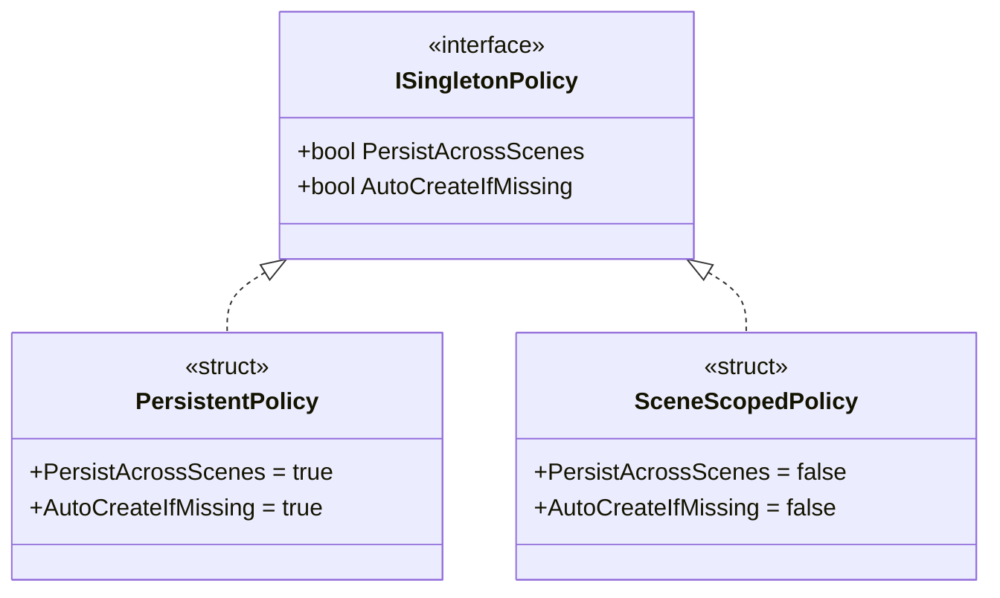

# Policy-Driven Unity Singleton (v1.0.1)

[Japanese README](./README.ja.md)

A **policy-driven singleton base class** for MonoBehaviour.

## Table of Contents

- [Requirements](#requirements)
- [Performance Considerations](#performance-considerations)
- [Overview](#overview)
  - [Provided Classes](#provided-classes)
  - [Key Features](#key-features)
- [Architecture](#architecture)
  - [Component Overview](#component-overview)
  - [Policy Comparison](#policy-comparison)
  - [Domain Reload Disabled: Play Session Boundary](#domain-reload-disabled-play-session-boundary)
- [Directory Structure](#directory-structure)
- [Dependencies](#dependencies-assumed-unity-api-behavior)
- [Installation](#installation)
- [Usage](#usage)
  - [GlobalSingleton](#1-globalsingleton)
  - [SceneSingleton](#2-scenesingleton)
  - [Choosing Between Instance and TryGetInstance](#3-choosing-between-instance-and-trygetinstance-typical-patterns)
  - [Caching is Recommended](#4-caching-is-recommended-important)
- [Public API Details](#public-api-details)
- [Design Intent](#design-intent-notes)
- [Constraints & Best Practices](#constraints--best-practices)
- [Advanced Topics](#advanced-topics)
- [Edit Mode Behavior](#edit-mode-behavior-details)
- [IDE Configuration](#ide-configuration-rider--resharper)
- [Testing](#testing)
- [Known Limitations](#known-limitations)
- [Troubleshooting](#troubleshooting)
- [References](#references)
- [License](#license)

## Requirements

* **Unity 2022.3** or later (tested with Unity 6.3)
* Supports both enabled and disabled **Reload Domain** in **Enter Play Mode Options**
* No external dependencies

## Performance Considerations

* **Policy resolution**: Zero allocation (readonly struct)
* **Instance access**: Minimal allocation only during auto-creation
* **Search operations**: Uses Unity's optimized FindAnyObjectByType
* **Caching**: Caching references is recommended for frequent access

## Overview

This library provides two singleton base classes for different use cases.

They share the same core logic, while a **policy** controls the lifecycle behavior (persistence across scenes and whether auto-creation is allowed).

### Provided Classes

| Class | Persist Across Scenes | Auto-Create | Intended Use |
| --- | --- | --- | --- |
| **`GlobalSingleton<T>`** | ✅ Yes | ✅ Yes | Managers that should always exist for the entire game (e.g., GameManager) |
| **`SceneSingleton<T>`** | ❌ No | ❌ No | Controllers that only operate within a specific scene (e.g., LevelController) |

### Key Features

* **Policy-driven**: Separates persistence (`DontDestroyOnLoad`) and auto-creation behavior via policies.
* **Domain Reload disabled support**: Reliably resets caches per Play session using a Play session ID, even when static fields survive between sessions.
* **Safe lifecycle**:
  * **Quitting**: Considers `Application.quitting` and prevents creation/access during shutdown.
  * **Edit Mode**: Performs *lookup only* in the editor, and does not create instances or mutate static caches (no side effects).
  * **Reinitialization (Soft Reset)**: Performs state reset at the **Play-session boundary** and reinitializes every Play session (aligned with the `PlaySessionId` strategy).
* **Strict type checks**: Rejects references where the generic type `T` does not exactly match the concrete runtime type, preventing misuse.
* **Development safety (DEV/EDITOR/ASSERTIONS)**:
  * **Fail-fast scope**: Fail-fast guards run in the Editor and Development builds, and can also run in Player builds when assertions are enabled (e.g., via `BuildOptions.ForceEnableAssertions` / `UNITY_ASSERTIONS`).

Notes on quitting (important):
- Unity's quit / Play Mode exit event order can vary by Unity version and environment (Editor vs Player).
- This library does **not** attempt to fully control the shutdown sequence; it uses `IsQuitting` as a **best-effort guard** to suppress singleton access and avoid resurrection during shutdown.
- `FindAnyObjectByType(...Exclude)` does **not** consider inactive objects, so an inactive singleton can be treated as "missing" → auto-created → silently duplicated. To prevent this, DEV/EDITOR/ASSERTIONS can use **fail-fast** (throws) when an inactive singleton is detected.
- Accessing a SceneSingleton that was not placed in the scene also uses **fail-fast** (throws) in DEV/EDITOR/ASSERTIONS.
- **Player build optimization**: Logs and most validation calls are stripped via `[Conditional]`.
  - If assertions are enabled in a Player build (e.g., `BuildOptions.ForceEnableAssertions` / `UNITY_ASSERTIONS`), some development guards can remain active.
  - When validations are stripped, the API fails-soft and returns `null` / `false` on failure (callers must handle this).

## Architecture

### Component Overview

```text
┌─────────────────────────────────────────────────────────────────────┐
│                           Public API                                │
│  ┌───────────────────────────┐    ┌───────────────────────────────┐ │
│  │    GlobalSingleton<T>     │    │      SceneSingleton<T>        │ │
│  │    (PersistentPolicy)     │    │     (SceneScopedPolicy)       │ │
│  │  • DontDestroyOnLoad      │    │  • Scene lifecycle bound      │ │
│  │  • Auto-create if missing │    │  • No auto-create             │ │
│  └─────────────┬─────────────┘    └───────────────┬───────────────┘ │
└────────────────┼──────────────────────────────────┼─────────────────┘
                 │                                  │
                 └──────────────┬───────────────────┘
                                │ inheritance
                                ▼
┌─────────────────────────────────────────────────────────────────────┐
│                 SingletonBehaviour<T, TPolicy>                      │
│  ┌─────────────────┐ ┌─────────────────┐ ┌────────────────────────┐ │
│  │    Instance     │ │  TryGetInstance │ │   Lifecycle Hooks      │ │
│  │  (auto-create)  │ │  (safe access)  │ │  OnPlaySessionStart()  │ │
│  └─────────────────┘ └─────────────────┘ └────────────────────────┘ │
└─────────────────────────────┬───────────────────────────────────────┘
                              │ uses
          ┌───────────────────┼───────────────────┐
          ▼                   ▼                   ▼
┌─────────────────┐  ┌─────────────────┐  ┌─────────────────────────┐
│ SingletonRuntime│  │ ISingletonPolicy│  │    SingletonLogger      │
│ • PlaySessionId │  │ • PersistAcross │  │ • Log/Warn/Error        │
│ • IsQuitting    │  │   Scenes        │  │ • Conditional compile   │
│ • Thread check  │  │ • AutoCreateIf  │  │ • Stripped in Player    │
│                 │  │   Missing       │  │   builds                │
└────────┬────────┘  └─────────────────┘  └─────────────────────────┘
         │ editor hooks
         ▼
┌─────────────────────┐
│SingletonEditorHooks │
│ (Play Mode events)  │
└─────────────────────┘
````

Notes:
* **Editor hooks direction**: `SingletonEditorHooks` (Editor-only) calls `SingletonRuntime.NotifyQuitting()`; runtime code does not depend on Editor hooks.
* **Namespaces/assemblies**: `SingletonEditorHooks` exists under `TomoLudens.PolicySingleton.Editor` and is compiled only in the Editor.

### Policy Comparison



Notes:

* Policies are implemented as `readonly struct` with constant getters (values are effectively compile-time constants).

### Domain Reload Disabled: Play Session Boundary

```text
 Play Session 1                          Play Session 2
───────────────────────────────────────────────────────────────────────────────▶
                                                                          time
    ┌─────────────────────┐              ┌─────────────────────┐
    │  PlaySessionId: 1   │              │  PlaySessionId: 2   │
    └─────────────────────┘              └─────────────────────┘
              │                                      │
    ┌──────────▼────────┐                ┌───────────▼─────────┐
    │  Static cache OK  │                │   Static cache OK   │
    │  Instance: 0xABC  │   ─────────▶   │   Instance: 0xABC   │ (same object)
    └───────────────────┘   Invalidate   └─────────────────────┘
                            & Refresh
                                 │
                    ┌────────────▼────────────┐
                    │ OnPlaySessionStart()    │
                    │ called again            │
                    │ (per-session reinit)    │
                    └─────────────────────────┘
```

Notes:
* The static cache (`_instance`) is cleared when `PlaySessionId` changes, even if the underlying scene object still exists.

## Directory Structure

```text
PolicySingleton/
├── Core/
│   ├── AssemblyInfo.cs                                     # InternalsVisibleTo (for tests)
│   ├── SingletonBehaviour.cs                               # Core implementation
│   ├── SingletonLogger.cs                                  # Conditional logger (stripped in Player builds)
│   └── SingletonRuntime.cs                                 # Internal runtime (Domain Reload handling)
├── Editor/
│   ├── SingletonEditorHooks.cs                             # Editor event hooks (Play Mode state)
│   └── TomoLudens.PolicySingleton.Editor.asmdef            # Editor assembly definition
├── Policy/
│   ├── ISingletonPolicy.cs                                 # Policy interface
│   ├── PersistentPolicy.cs                                 # Persistent policy implementation
│   └── SceneScopedPolicy.cs                                # Scene-scoped policy implementation
├── Tests/                                                  # PlayMode & EditMode tests
│   ├── Editor/
│   │   ├── PolicySingletonEditorTests.cs                   # EditMode tests
│   │   └── TomoLudens.PolicySingleton.Editor.Tests.asmdef  # Editor test assembly
│   ├── Runtime/
│   │   ├── PolicySingletonRuntimeTests.cs                  # PlayMode tests
│   │   └── TomoLudens.PolicySingleton.Tests.asmdef         # Runtime test assembly
│   └── TestExtensions.cs                                   # Test-only extension methods
├── GlobalSingleton.cs                                      # Public API (persistent + auto-create)
├── SceneSingleton.cs                                       # Public API (scene-scoped + no auto-create)
└── TomoLudens.PolicySingleton.asmdef                       # Assembly Definition
```

## Dependencies (Assumed Unity API Behavior)

This implementation assumes the following Unity behaviors. If Unity changes these behaviors, the design assumptions may need revisiting.

| API / Feature                                                | Assumed Behavior                                                                                                                                                                                                                     |
| ------------------------------------------------------------ | ------------------------------------------------------------------------------------------------------------------------------------------------------------------------------------------------------------------------------------ |
| Domain Reload disabled                                       | **Static variables** and **static event subscriptions** persist across Play sessions. The library invalidates caches using `PlaySessionId`.                                                                                          |
| Scene Reload disabled                                        | When Scene Reload is disabled, scenes are not reloaded. The library **does not** assume the same callback order as a fresh app launch (new-load semantics). State reset is aligned to the Play-session boundary via `PlaySessionId`. |
| `Object.FindAnyObjectByType<T>(FindObjectsInactive.Exclude)` | By default, inactive objects are excluded. Also, the object returned by `FindAnyObjectByType` is **not guaranteed to be the same between calls** (non-deterministic selection).                                                      |
| `FindObjectsInactive`                                        | Find APIs can be configured to include or exclude inactive objects; default is exclusion in most find methods.                                                                                                                       |
| `Object.DontDestroyOnLoad`                                   | Must be applied to a **root GameObject** (therefore Persistent singletons may reparent to root when needed).                                                                                                                         |
| `Object.Destroy`                                             | Actual destruction is delayed until after the current Update loop (but before rendering).                                                                                                                                            |

## Installation

1. Place the `PolicySingleton` folder anywhere in your project (e.g., `Assets/Plugins/PolicySingleton/`).
2. Adjust namespaces and assembly definitions as needed.

## Usage

### 1. GlobalSingleton

Persists across scenes, and auto-creates when accessed if not found.

```csharp
using TomoLudens.PolicySingleton;

// Sealing is recommended to prevent accidental inheritance.
public sealed class GameManager : GlobalSingleton<GameManager>
{
    public int Score { get; private set; }
    public int CurrentLevel { get; private set; }

    protected override void Awake()
    {
        base.Awake(); // Required - initializes singleton
        Score = 0;
        CurrentLevel = 1;
    }

    // Per-play-session reinitialization (especially with Domain Reload disabled)
    protected override void OnPlaySessionStart()
    {
        // Called at the start of each play session (Play Mode start or restart with Domain Reload disabled)
        // Awake is called only on first run, but OnPlaySessionStart is called every play session
        Debug.Log($"New play session started. Current level: {CurrentLevel}");

        // Reset session-specific state
        // Example: temporary data, event subscriptions, caches, etc.
        ResetTemporaryData();
        RebindEvents();
    }

    private void ResetTemporaryData()
    {
        // Clear temporary data that shouldn't persist between play sessions
        // Example: UI state, unsaved work-in-progress data, etc.
    }

    private void RebindEvents()
    {
        // Re-subscribe to events (in case subscriptions are lost with Domain Reload disabled)
        // Example: GameManager.OnGameStateChanged += HandleGameStateChanged;
    }

    public void AddScore(int value) => Score += value;
    public void NextLevel() => CurrentLevel++;
}

// Example:
// GameManager.Instance.AddScore(10);
// GameManager.Instance.NextLevel();
```

#### Importance of OnPlaySessionStart

`OnPlaySessionStart` is especially important when **Domain Reload is disabled**:

| Method                 | Called When                   | Purpose                                                               |
| ---------------------- | ----------------------------- | --------------------------------------------------------------------- |
| `Awake()`              | Only on first Play Mode start | Persistent initialization (resource loading, static settings)         |
| `OnPlaySessionStart()` | **Every play session**        | Session-specific initialization (temporary data, event subscriptions) |

**Why is it needed?**
* When Domain Reload is disabled, static fields persist between play sessions
* Event subscriptions and temporary data might remain from the previous session
* `OnPlaySessionStart` ensures a clean state for each session

### 2. SceneSingleton

Must be placed in the scene. No auto-creation. Destroyed when the scene unloads.

```csharp
using TomoLudens.PolicySingleton;

public sealed class LevelController : SceneSingleton<LevelController>
{
    protected override void Awake()
    {
        base.Awake(); // Required - initializes singleton
        // Per-scene initialization
    }
}

// ⚠️ Must be placed in the scene.
// If you forget to place it: DEV/EDITOR/ASSERTIONS throws; otherwise Player builds return null.
// LevelController.Instance.DoSomething();
```

### 3. Choosing Between `Instance` and `TryGetInstance` (Typical Patterns)

In Player builds, most DEV/EDITOR validations are stripped via `ConditionalAttribute`. If assertions are enabled (`UNITY_ASSERTIONS`), some fail-fast guards may remain active.

| Choice               | Rule of Thumb                                                                                                                      | Examples                                                                                        |
| -------------------- | ---------------------------------------------------------------------------------------------------------------------------------- | ----------------------------------------------------------------------------------------------- |
| **`Instance`**       | Use when the feature is **required**, and a missing instance is not acceptable.                                                    | Essential managers during **startup/initialization** (`GameManager`, `AudioManager`, etc.)      |
| **`TryGetInstance`** | Use when "if it exists, use it; otherwise do nothing" is correct.<br>Avoid unintended creation/resurrection and ordering coupling. | **Cleanup / unregister / pause** flows (`OnDisable` / `OnDestroy` / `OnApplicationPause`, etc.) |

#### Typical: Use TryGetInstance for cleanup/unregister paths

```csharp
private void OnDisable()
{
    if (AudioManager.TryGetInstance(out var am))
    {
        am.Unregister(this);
    }
}

private void OnDestroy()
{
    if (GameManager.TryGetInstance(out var gm))
    {
        gm.Unregister(this);
    }
}

private void OnApplicationPause(bool paused)
{
    if (paused && Telemetry.TryGetInstance(out var t))
    {
        t.Flush();
    }
}
```

#### Typical: Use Instance at startup to reliably establish (with caching)

```csharp
private GameManager _gm;

private void Awake()
{
    _gm = GameManager.Instance; // required → Instance
}

private void Update()
{
    if (_gm == null) return; // defensive guard since Player builds may return null
    // ...
}
```

### 4. Caching is Recommended (Important)

`Instance` performs internal lookup and validation, so **avoid calling it every frame (e.g., inside `Update`)**. Fetch once in `Start` / `Awake`, cache the reference, and reuse it.

```csharp
public class Player : MonoBehaviour
{
    private GameManager _gameManager;

    private void Start()
    {
        _gameManager = GameManager.Instance; // cache here
    }

    private void Update()
    {
        if (_gameManager == null) return;
        // _gameManager.DoSomething();
    }
}
```

## Public API Details

### `static T Instance { get; }`

| State                 | Behavior                                                                                                                                                                                                                                                                                        |
| --------------------- | ----------------------------------------------------------------------------------------------------------------------------------------------------------------------------------------------------------------------------------------------------------------------------------------------- |
| **Playing (normal)**  | Returns the cached instance if established. Otherwise searches, and Persistent may auto-create if needed.                                                                                                                                                                                       |
| **During quitting**   | Always returns `null`.                                                                                                                                                                                                                                                                          |
| **Edit Mode**         | Lookup only (no creation, and no static cache mutation).                                                                                                                                                                                                                                        |
| **Inactive detected** | Throws in DEV/EDITOR/ASSERTIONS; returns `null` in Player builds when guards are stripped.                                                                                                                                                                                                      |
| **Type mismatch**     | Rejects references whose runtime type doesn’t exactly match `T` (e.g., derived types).<br>In Play Mode, the library may deactivate the GameObject before destroying it to avoid same-frame re-detection because `Destroy` is deferred and `FindAnyObjectByType` selection is non-deterministic. |
| **Scene missing**     | If a SceneSingleton is not found: throws in DEV/EDITOR/ASSERTIONS; returns `null` in Player builds when guards are stripped.                                                                                                                                                                    |

### `static bool TryGetInstance(out T instance)`

Returns the instance if present. **Does not auto-create**.

| State               | Behavior                              |
| ------------------- | ------------------------------------- |
| **Present**         | Returns `true` and a valid reference. |
| **Not present**     | Returns `false` and `null`.           |
| **During quitting** | Always returns `false`.               |
| **Edit Mode**       | Lookup only (does not cache).         |

## Design Intent (Notes)

### Why split behavior via policies?

To separate "behavior" such as persistence and auto-creation into policies (`ISingletonPolicy`) while keeping the core logic shared.

### Why is `SingletonRuntime` required?

With Domain Reload disabled, static fields and static event subscriptions can persist across Play sessions. Therefore the library must invalidate per-type static caches at each Play start.

1. Update `PlaySessionId` at Play start from a reliably invoked point (`SubsystemRegistration`).
2. The singleton side checks `PlaySessionId` and invalidates stale caches, forcing re-lookup.

### Why centralize initialization in `SingletonRuntime`?

With Domain Reload disabled, there is no guarantee that static state resets to defaults at each Play. Unity's documentation explicitly states that static variables and static event subscriptions can persist when Domain Reload is disabled.

Therefore, this library updates `PlaySessionId` at each Play start and makes `SingletonBehaviour` invalidate stale static caches reliably.

Additionally, Unity has a known issue where `RuntimeInitializeOnLoadMethod` on a **generic** class may not be invoked as expected (Issue Tracker). For this reason, initialization is centralized in the non-generic `SingletonRuntime`.

## Constraints & Best Practices

### 0. Intentional Constraints (Design Contract)

This library intentionally enforces constraints to reduce hard-to-debug Unity issues (hidden duplicates, resurrection during quit, and ordering coupling). In DEV/EDITOR builds (and assertions-enabled Player builds), some of these become fail-fast exceptions.

* **Main thread only (Play Mode)**: `Instance` / `TryGetInstance` must be called from the main thread.
* **Exact type required**: A reference where the runtime type does not exactly match `T` is rejected (e.g., a derived type is not accepted).
* **Avoid inactive/disabled instances**: Inactive/disabled components can be treated as "missing" by Unity find APIs; DEV/EDITOR/ASSERTIONS can throw to prevent hidden duplication.
* **SceneSingleton must be placed**: Scene-scoped singletons are never auto-created; forgetting placement throws in DEV/EDITOR/ASSERTIONS and returns `null` / `false` when guards are stripped in Player builds.
* **During quitting**: Singleton access is suppressed (`null` / `false`) as a best-effort guard against resurrection.
* **Player builds may return null/false (and may still throw if assertions-enabled guards are active)**: DEV/EDITOR-only exceptions and logs are stripped by design; callers must handle `null` / `false`.

### 1. Seal concrete classes

Further inheriting from a concrete singleton (e.g., `GameManager`) is not recommended.
Inheritance like `class Derived : GameManager` is rejected at runtime by the type-check mechanism.

### 2. If you override Unity messages, base calls are required

If you override `Awake`, `OnEnable`, or `OnDestroy`, you must call the base method.

Notes on enforcement (what the library can/cannot detect automatically):

* Missing `base.Awake()` is detected and logged from the base `OnEnable()` path (when it runs).
* Missing `base.OnEnable()` / `base.OnDestroy()` is not reliably detectable, but skipping them can break initialization/cleanup behavior.

```csharp
protected override void Awake()
{
    base.Awake(); // required
    // additional initialization
}
```

Even if you forget, there is a safety net that initializes on the first `Instance` / `TryGetInstance` access. However, that obscures ordering and is not recommended. Always call `base.Awake()` at the beginning of your overridden `Awake()` method.

### 3. Placement guidelines

* **Do not place duplicates**: Do not place the same singleton in multiple scenes (the later-loaded one will be destroyed).
* **Persistent expects root placement**: If attached under a child, it will reparent to root and persist; DEV/EDITOR emits a warning.
* **Do not keep it disabled**: Avoid leaving singleton components Disabled; they can be treated as "missing" and lead to hidden duplication.
* **Use a dedicated GameObject**: In Play Mode, this library may destroy the entire GameObject when it detects duplicates or type mismatches. Avoid attaching unrelated components to the same GameObject.

## Advanced Topics

### Soft Reset (per-Play reinitialization)

With Domain Reload disabled, static state can persist. This library invalidates caches at the Play-session boundary (`PlaySessionId`) and reinitializes every Play session to reset state.

Because Unity calls `Awake()` only once per GameObject lifetime, do **per-Play reinitialization** by overriding `OnPlaySessionStart()` (called once per Play session when the singleton is established).

Write your `OnPlaySessionStart()` logic to be **idempotent** (e.g., "unsubscribe → subscribe" for event hookups).

### Threading / Main Thread

`Instance` / `TryGetInstance` call UnityEngine APIs (Find / GameObject creation). Therefore, during Play Mode they must be called from the **main thread**.

### Initialization Order

If you need strict initialization order, fix it via a Bootstrap class with `DefaultExecutionOrder`.

```csharp
[DefaultExecutionOrder(-10000)]
public class Bootstrap : MonoBehaviour
{
    void Awake()
    {
        _ = GameManager.Instance;
        _ = AudioManager.Instance;
        _ = InputManager.Instance;
    }
}
```

## Edit Mode Behavior (Details)

In Edit Mode (`Application.isPlaying == false`), behavior is fixed:

* `Instance` / `TryGetInstance` perform **lookup only** (no auto-creation).
* **Static caches are not updated** (no side effects).
* Therefore, references from custom inspectors or editor tooling do not affect Play Mode state.

> Note: `FindAnyObjectByType<T>(FindObjectsInactive.Exclude)` excludes inactive objects by default. Because an inactive singleton can be treated as "not found," DEV/EDITOR/ASSERTIONS can choose fail-fast.

## IDE Configuration (Rider / ReSharper)

### `StaticMemberInGenericType` warning

`static` fields in `SingletonBehaviour<T, TPolicy>` (such as `_instance`) are isolated per generic instantiation.

This is **intended behavior** for this singleton design, so align your team on one approach:

* Use suppression comments in code, or
* Adjust severity via `.DotSettings`, etc.

## Testing

### Included Tests

This package includes comprehensive PlayMode and EditMode tests with **74 total tests** (53 PlayMode + 21 EditMode), all passing.

#### PlayMode Tests (53 tests)

| Category               | Tests | Coverage                                                   |
| ---------------------- | ----- | ---------------------------------------------------------- |
| GlobalSingleton        | 7     | Auto-creation, caching, duplicate detection                |
| SceneSingleton         | 5     | Placement, no auto-create, duplicate detection             |
| InactiveInstance       | 3     | Inactive GameObject detection, disabled component          |
| TypeMismatch           | 2     | Derived class rejection                                    |
| ThreadSafety           | 7     | Background thread protection, main thread validation       |
| Lifecycle              | 2     | Destruction, recreation                                    |
| SoftReset              | 1     | Per-Play reinitialization on PlaySessionId boundary        |
| SceneSingletonEdgeCase | 2     | Not placed, no auto-create                                 |
| PracticalUsage         | 6     | GameManager, LevelController, state management             |
| PolicyBehavior         | 3     | Policy-driven behavior validation                          |
| ResourceManagement     | 3     | Instance lifecycle and cleanup                             |
| DomainReload           | 6     | PlaySessionId boundary, cache invalidation, quitting state |
| ParentHierarchy        | 2     | Root reparenting for DontDestroyOnLoad                     |
| BaseAwakeEnforcement   | 1     | base.Awake() call detection                                |
| EdgeCase               | 3     | Destroyed instance cleanup, rapid access, placement timing |

#### EditMode Tests (21 tests)

| Category                      | Tests | Coverage                                                     |
| ----------------------------- | ----- | ------------------------------------------------------------ |
| SingletonRuntimeEditMode      | 2     | PlaySessionId, IsQuitting validation                         |
| Policy                        | 5     | Policy struct validation, immutability, interface compliance |
| SingletonBehaviourEditMode    | 5     | EditMode behavior, caching isolation                         |
| SingletonLifecycleEditMode    | 3     | Parent hierarchy, creation, coexistence in Edit Mode         |
| SingletonRuntimeStateEditMode | 2     | NotifyQuitting, PlaySessionId consistency                    |
| SingletonLoggerEditMode       | 4     | Log, LogWarning, LogError, ThrowInvalidOperation APIs        |

### Running Tests

1. Open **Window → General → Test Runner**
2. Select **PlayMode** or **EditMode** tab
3. Click **Run All**

### Writing Your Own Tests

Test-only APIs are available via `TestExtensions`:

```csharp
// Reset static instance cache (uses reflection)
default(MyManager).ResetStaticCacheForTesting();
```

**Example Test:**

```csharp
[UnityTest]
public IEnumerator MyManager_AutoCreates()
{
    var instance = MyManager.Instance;
    yield return null;

    Assert.IsNotNull(instance);
}

[TearDown]
public void TearDown()
{
    if (MyManager.TryGetInstance(out var instance))
    {
        Object.DestroyImmediate(instance.gameObject);
    }
    default(MyManager).ResetStaticCacheForTesting();
}
```

### PlayMode Test Considerations

* `RuntimeInitializeOnLoadMethod` runs in PlayMode tests.
* `PlaySessionId` advances between tests, providing static cache isolation.
* Always clean up in `TearDown` to avoid test pollution.

## Known Limitations

### Static Constructor Timing

If a singleton class has a static constructor, it may execute before `PlaySessionId` is initialized. This can rarely cause unexpected behavior.

### Thread Safety

All singleton operations must be called from the main thread. Access from background threads returns `null` / `false` instead of throwing exceptions, ensuring stable behavior across Unity versions.

### Scene Loading Order

If multiple scenes contain the same singleton type, the destruction order depends on Unity's scene loading sequence.

### Memory Leaks

If static event subscriptions are not properly cleaned up in `OnDestroy`, memory leaks can occur when Domain Reload is disabled.

## Troubleshooting

### FAQ

**Q. Singleton returns null in Play Mode**
Check that the component is active and enabled, and that you're calling from the main thread. If you override Awake, verify that `base.Awake()` is called.

**Q. Getting duplicate singleton warnings**
The same singleton may be placed in multiple scenes. Check scenes and prefabs, and remove duplicate instances.

**Q. Exceptions occur in the Editor / Development builds (or in assertions-enabled Player builds)**
This is due to fail-fast behavior in DEV/EDITOR/ASSERTIONS. Verify that SceneSingleton is placed in the scene. Use `TryGetInstance()` for conditional access.

**Q. Can I call `Instance` every frame?**
It works, but it is not recommended. Cache it in `Start` / `Awake`.

**Q. What happens if I override `Awake` and forget `base.Awake()`?**
Initialization is deferred and occurs on the first `Instance` / `TryGetInstance` access. It still runs, but the timing becomes unexpectedly late, so always call the base method.

**Q. What happens if I forget to place a SceneSingleton in the scene?**
DEV/EDITOR/ASSERTIONS throws an exception; Player builds return `null` / `false` when guards are stripped. GlobalSingleton auto-creates if not found.

**Q. Fail-fast exceptions occur in a Player build (not only in the Editor).**
Assertions might be enabled in that Player build (for example by using `BuildOptions.ForceEnableAssertions`, which includes assertions outside Development builds). Disable assertions for the build or adjust which guards are conditioned on `UNITY_ASSERTIONS`.

### Built-in Debug Logging

The library outputs debug logs when at least one of these symbols is defined: `UNITY_EDITOR`, `DEVELOPMENT_BUILD`, `UNITY_ASSERTIONS` (calls are stripped otherwise).

| Level       | Message                                             | Trigger                                                  |
| ----------- | --------------------------------------------------- | -------------------------------------------------------- |
| **Log**     | `OnPlaySessionStart invoked.`                       | When a singleton's per-session initialization runs       |
| **Log**     | `Instance access blocked: application is quitting.` | When `Instance` returns null due to quitting             |
| **Log**     | `TryGetInstance blocked: application is quitting.`  | When `TryGetInstance` returns false due to quitting      |
| **Warning** | `Auto-created.`                                     | When a GlobalSingleton is auto-created                   |
| **Warning** | `Duplicate detected.`                               | When a duplicate singleton is destroyed                  |
| **Warning** | `Reparented to root for DontDestroyOnLoad.`         | When a persistent singleton under a parent is reparented |
| **Error**   | `base.Awake() was not called`                       | When a subclass forgets to call `base.Awake()`           |
| **Error**   | `Type mismatch`                                     | When a derived class is found instead of exact type      |

> Note: Enabling assertions in a Player build (`UNITY_ASSERTIONS`) can keep some fail-fast guards active and can also enable debug logging (by design).

### Debugging Tips

```csharp
// Check singleton state
if (MySingleton.TryGetInstance(out var instance))
{
    Debug.Log($"Singleton found: {instance.name}");
}
else
{
    Debug.LogWarning("Singleton not available");
}
```

## References

Domain Reload (Manual)
[https://docs.unity3d.com/6000.3/Documentation/Manual/domain-reloading.html](https://docs.unity3d.com/6000.3/Documentation/Manual/domain-reloading.html)

Scene Reload (Manual)
[https://docs.unity3d.com/6000.2/Documentation/Manual/scene-reloading.html](https://docs.unity3d.com/6000.2/Documentation/Manual/scene-reloading.html)

RuntimeInitializeOnLoadMethodAttribute (Scripting API)
[https://docs.unity3d.com/6000.3/Documentation/ScriptReference/RuntimeInitializeOnLoadMethodAttribute.html](https://docs.unity3d.com/6000.3/Documentation/ScriptReference/RuntimeInitializeOnLoadMethodAttribute.html)

RuntimeInitializeLoadType.SubsystemRegistration (Scripting API)
[https://docs.unity3d.com/6000.3/Documentation/ScriptReference/RuntimeInitializeLoadType.SubsystemRegistration.html](https://docs.unity3d.com/6000.3/Documentation/ScriptReference/RuntimeInitializeLoadType.SubsystemRegistration.html)

Object.FindAnyObjectByType (Scripting API)
[https://docs.unity3d.com/2023.1/Documentation/ScriptReference/Object.FindAnyObjectByType.html](https://docs.unity3d.com/2023.1/Documentation/ScriptReference/Object.FindAnyObjectByType.html)

FindObjectsInactive (Scripting API)
[https://docs.unity3d.com/2022.3/Documentation/ScriptReference/FindObjectsInactive.html](https://docs.unity3d.com/2022.3/Documentation/ScriptReference/FindObjectsInactive.html)

Object.Destroy (Scripting API)
[https://docs.unity3d.com/6000.3/Documentation/ScriptReference/Object.Destroy.html](https://docs.unity3d.com/6000.3/Documentation/ScriptReference/Object.Destroy.html)

Object.DontDestroyOnLoad (Scripting API)
[https://docs.unity3d.com/6000.3/Documentation/ScriptReference/Object.DontDestroyOnLoad.html](https://docs.unity3d.com/6000.3/Documentation/ScriptReference/Object.DontDestroyOnLoad.html)

Application.quitting (Scripting API)
[https://docs.unity3d.com/6000.3/Documentation/ScriptReference/Application-quitting.html](https://docs.unity3d.com/6000.3/Documentation/ScriptReference/Application-quitting.html)

DefaultExecutionOrder (Scripting API)
[https://docs.unity3d.com/6000.3/Documentation/ScriptReference/DefaultExecutionOrder.html](https://docs.unity3d.com/6000.3/Documentation/ScriptReference/DefaultExecutionOrder.html)

BuildOptions.ForceEnableAssertions (Scripting API)
[https://docs.unity3d.com/6000.2/Documentation/ScriptReference/BuildOptions.ForceEnableAssertions.html](https://docs.unity3d.com/6000.2/Documentation/ScriptReference/BuildOptions.ForceEnableAssertions.html)

C# Conditional attribute (Microsoft Docs)
[https://learn.microsoft.com/en-us/dotnet/csharp/language-reference/attributes/general](https://learn.microsoft.com/en-us/dotnet/csharp/language-reference/attributes/general)

Unity Issue Tracker: RuntimeInitializeOnLoadMethodAttribute not invoked if class is generic
[https://issuetracker.unity3d.com/issues/runtimeinitializeonloadmethodattribute-not-invoked-if-class-is-generic](https://issuetracker.unity3d.com/issues/runtimeinitializeonloadmethodattribute-not-invoked-if-class-is-generic)

## Changelog

See [CHANGELOG.md](./CHANGELOG.md)

## License

See [LICENSE](./LICENSE).
